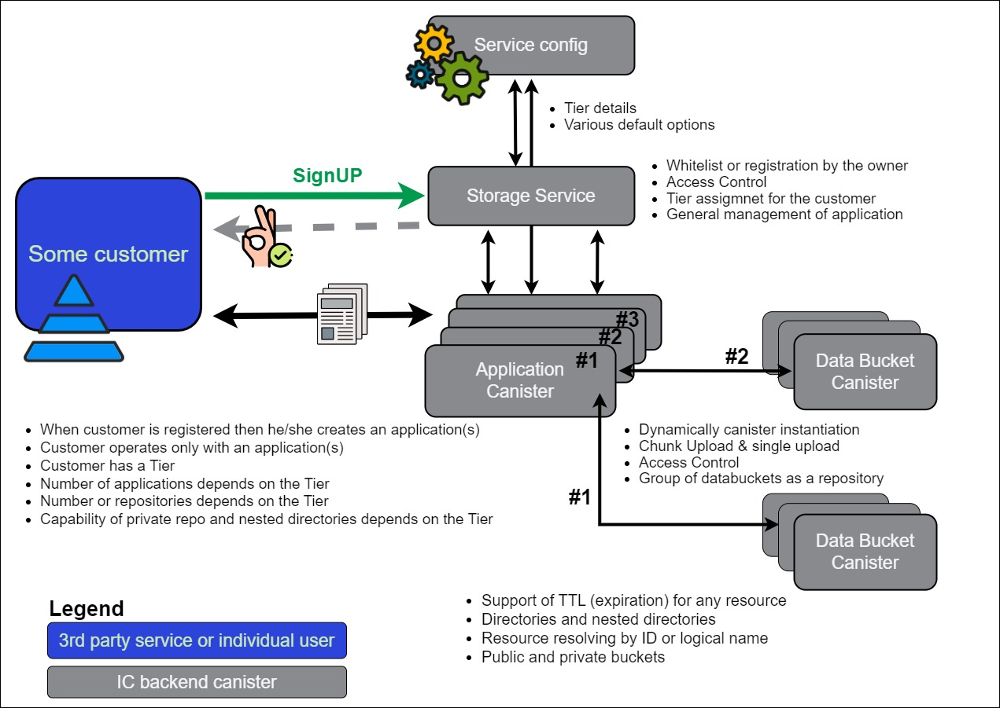
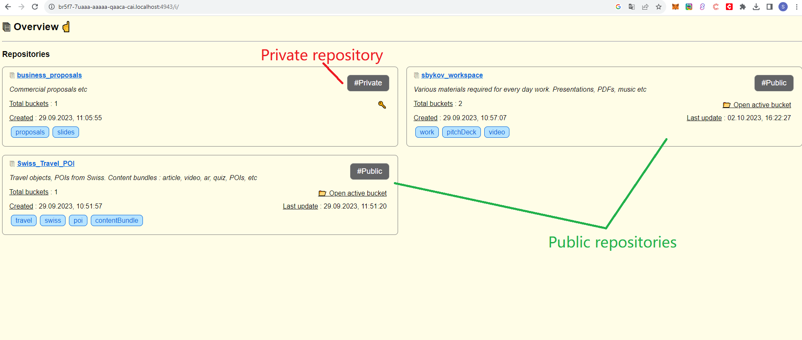
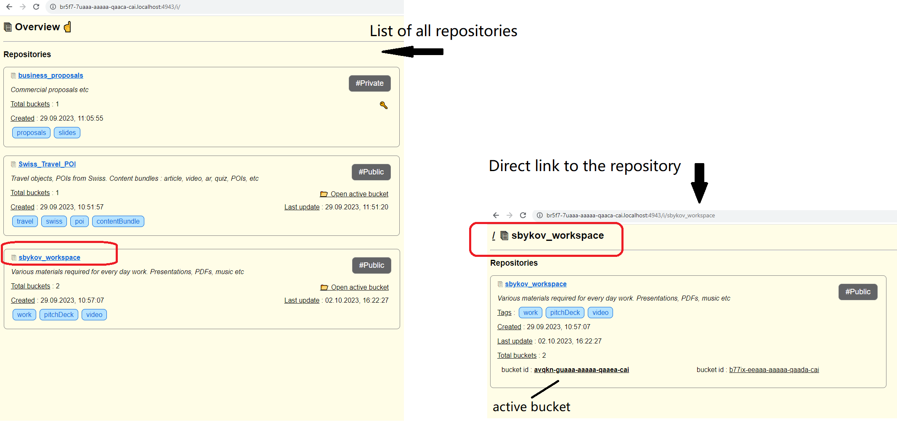
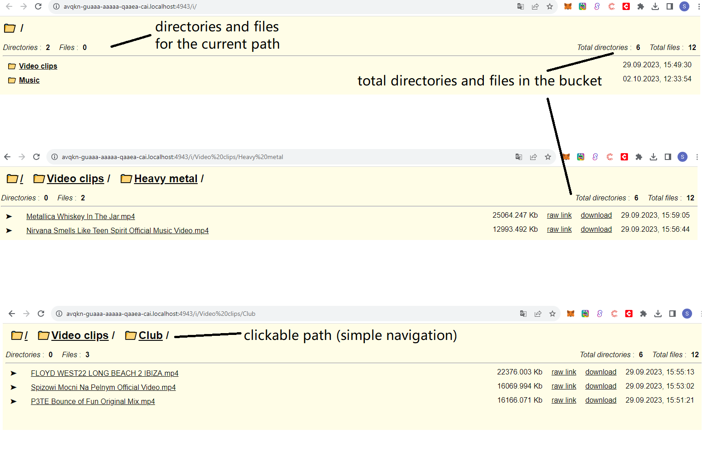
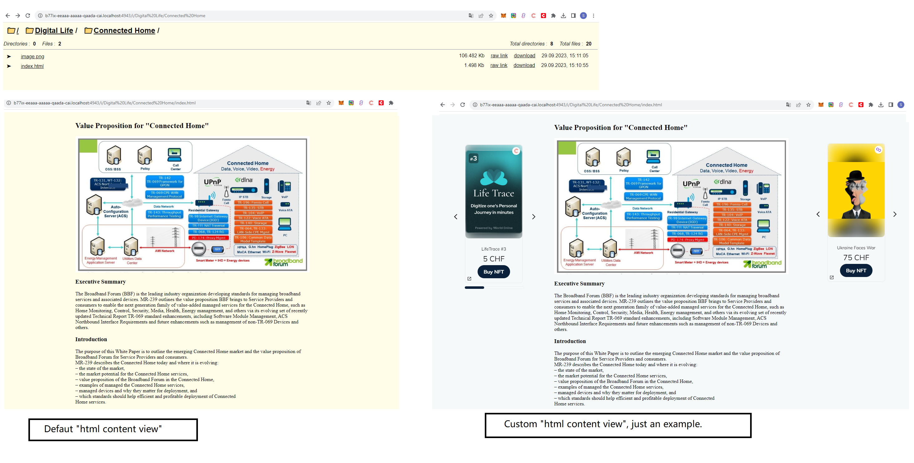
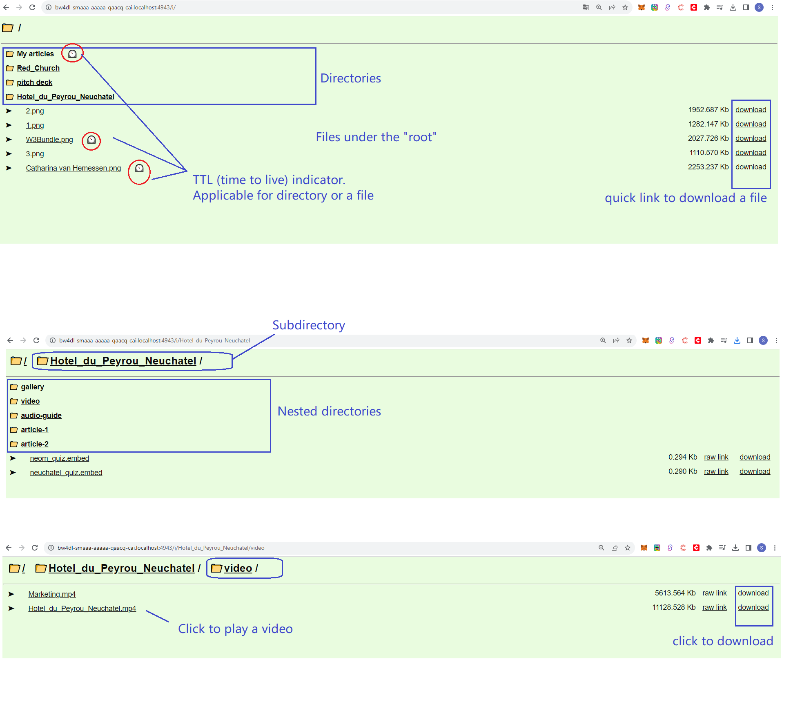
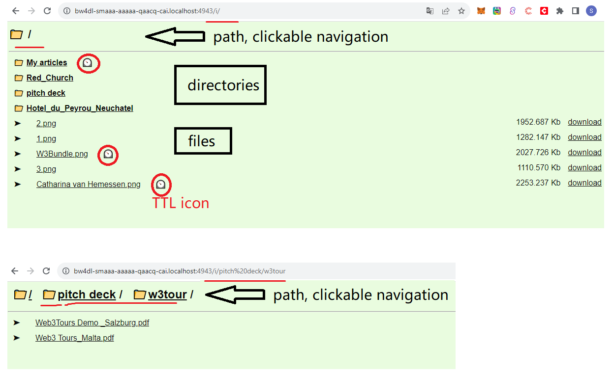
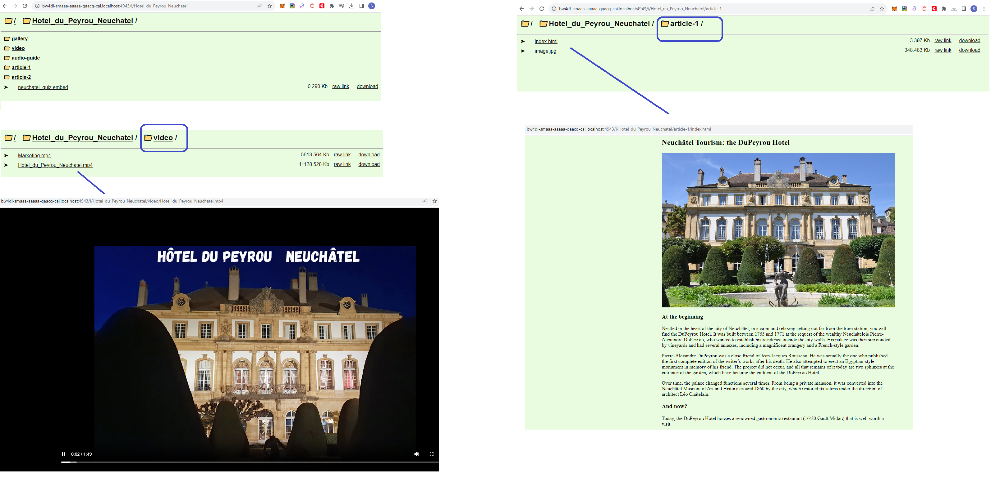
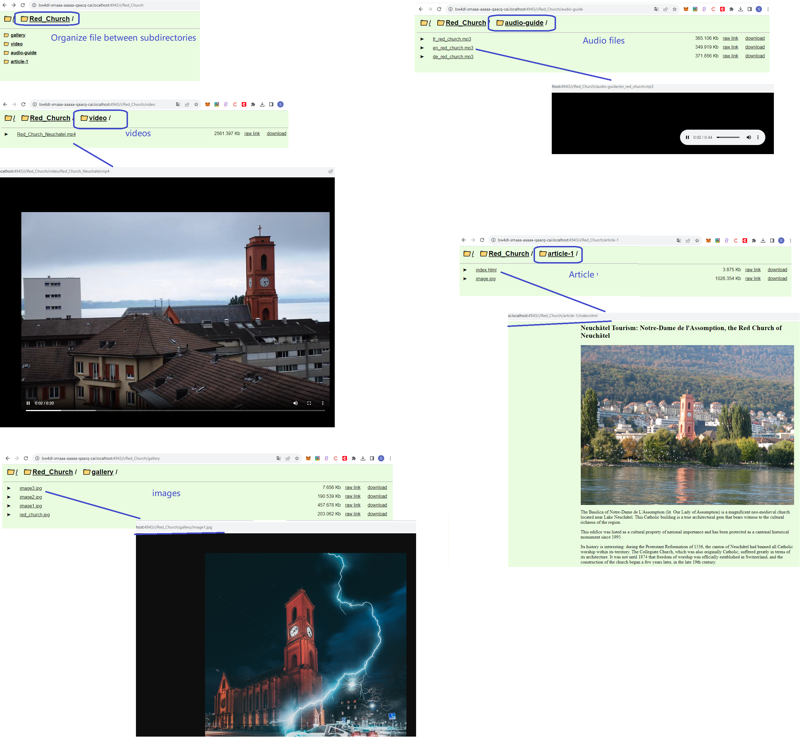

# IC based storage service (ics2)
The primary goal of this project is a creation of storage service to store and organize any kind of files. Yes, at first glance it might be similar to AWS S3 or Google drive where user can store files, share the access, 
have a direct http link to the file, organize the files within the directories etc.
Service allows to organize the data into repositories (private or public), applies the proper options of the scaling strategy, organize files in directories (nested directory is supported as well). 
Right now solution is made up of backend canister but meanwhile the application canister and data_bucket canister supports simple http interface to inspect the state of the data.

## Terms
Lets explain some terms that could be found in the source code or mentioned in this readme file.
- **Tier** - level of the customer / application
- **ApplicationService** or **StorageService** - name of the canister where all customers must be registered. This canister creates application canisters,  root entry point for the customers. The name is not finalized yet, so two version might be used in this file. A bit later new functions will be added to the project and name modifications are possible as well.
- **Application** - Canister that resembles to the customer "workspace". It is created by ApplicationService (StorageService). Application is a "container" for the repositories.
- **Repository** - organization of the data inside the application. Application may have 1 or more repositories. In turn, repository consist of one or more buckets where all resources actualy stored.
- **DataBucket** - Canister where all data is actually stored. Repository is made up of the buckets and should have an active bucket
- **Resource** - file or directory stored in the bucket
- **TTL** - time to live attribute that could be assigned to any resource. System periodically checks the resources and removes them if the TTL is specified and already reached.
- **Simple UI interface** - Application canister and DataBucket canister expose special http request path '/i/' that provides basic information about the canister. This simle interface has clickable links for the convenient navigation
- **Raw link** - UI interface of the DataBucket canitser refers to the `raw link`. Each resource always has a permanent direct link with a format like `/r/{HASH}`. It is a direct link. Also, if resource is under the directory, then it can be accessed by `name` (`full path`). So, it could be two types how to get the same file : either by direct link or by full path

## Introduction
The primary goal of the project is to store and organize user data (resources) with an option to have a direct http url to any file or directory. User decides what / when / how should be stored and accessed.

Some features:
- Grouping opportunities by the Tier level
- Service allows to organize data into repositoies (public or private)
- Customer can choose the appropritae scaling strategy from the supported list (disabled, auto with default thresholds or auto with custom thresholds)
- Directories and nested directories allows to have better organization of the files
- TTL on the file level or directory level
- Basic operations for the resource : make a copy (for a file), delete (file or directory), rename (file), apply http headers (file), apply TTL (file or directory)
- Application and DataBucket canister support simple UI interface to show the current data status ( url format : canister_address/i/)




## Installation
Step-by-step guide to get a copy of the project up and running locally for development and testing.


```bash
-- step1. start dfx
$ dfx start --background

-- step2. deploy service config actor and take the canister id for the step3
$ dfx deploy service_config

-- step3. deploy storage serice. 
-- The value of the parameter network and configuration service 
$ dfx deploy storage_service --argument="(record {network = variant {Local = \"localhost:4943\"};  configuration_service = opt ${VALUE_FROM_STEP2}; operators = vec {}; spawned_canister_controllers = vec {} } )";
```

## ServiceConfig Actor

The `ServiceConfig` actor is an Internet Computer canister for storing, managing default values, limits, tier options. 
If list of opportunities is going to be extended and they depend on some settings, then ServiceConfig actor is a good place to define any new settings, limits, default values etc

### Key Features

- Stroing current settings for the tier (number_of_applications, number_of_repositories, private_repository_forbidden, nested_directory_forbidden)
- Tracking the history of changes for the tier in case of modifications
- Storing default values that could be modified on demand by the service owner

### Interface

Some public methods of the `ServiceConfig` actor:

- `apply_scaling_memory_options(v:Types.MemoryThreshold)`: Applies the default memory threshold that is used for #Auto scaling strategy by default (if owner hasn't specified his memory options).
- `apply_app_init_cycles(v:Nat)`: Applies the amount of cycles that is used for new Application canister being created by StorageService actor.
- `apply_bucket_init_cycles(v:Nat)`: Applies the amount of cycles that is used for new DataBucket canister being created by Application actor
- `apply_tier_options(t:Types.TierId, settings:Types.TierOptionsArg) `: Registers a new tier or update the existing one.
- `get_tier_options_history (t:Types.TierId) : async [Types.TierOptions]` : Returns past tier options for the specified tier
- `get_tier_options(t:Types.TierId) : async Result.Result<Types.TierOptions, Types.Errors> ` : Returns current tier options or error if no tier registered
- `assets_list()`: Returns owner and list of operators of the service


## ApplicationService Actor

The `ApplicationService` actor is an Internet Computer canister for managing customers, application registration.
It is a main entry point to start work with the project

### Key Features

- Access control for the customers
- Application creation
- Tracking customers and their applications

### Interface

Some public methods of the `ApplicationService` (`StorageService`) actor:

- `apply_whitelist_customers(ids: [Principal])`: Applies the list of customers that can sign up and then registers their applications. The Free tier is applied for the customers from the whitelist.
- `migrate_customer_tier (identity : Principal, tier : Types.Tier)`: Applies another tier level for the existing customer
- `update_customer (args : Types.CommonUpdateArgs)`: Modifies customer name/description
- `update_my_application (args : Types.CommonUpdateArgs):`: Modifies name/description of the customer's application
- `get_my_customer () : async Result.Result<Types.CustomerView, Types.Errors>`: Returns customer metadata for the caller or error if no customer registered yet
- `update_my_customer (name:Text, description:Text) : async Result.Result<(), Types.Errors>` : Updates customer metadata for the caller. Returns error if no customer registered yet
- `register_customer (name : Text, description : Text, identity : Principal, tier_id : Types.TierId)` : Registers a new customer for the specified identity. Access control
- `signup_customer (name : Text, description : Text)` : Sign up method for any new customer. It works only if caller principal included into whiteList
- `register_application (name : Text, description : Text)` : Registers a new application and instantiates a new canister instance. Only existing customer can call this method
- `delete_application (id : Text)` : Removes the existing application canister BUT NOT the related data buckets
- `assets_list()`: Returns owner and list of operators for the service


## Application Actor

The `Application` actor is an Internet Computer canister for managing repositories inside the application, for storing and managing files inside the repositories.

### Key Features

- Repository management
- Data upload
- Data management
- Simple UI interface is accessible by url '/i/' 

### Interface

Some public methods of the `Application` actor:

- `register_repository (args : Types.RepositoryArgs)`: Registers a new repository (public or private). Method may return error if the assigned tier doesn't allow to create more repositories or private repo etc. If repository is created then new DataBucket instance is created and linked with a repo.
- `update_repository (repository_id: Text, args : Types.RepositoryUpdateArgs)`: Modifies metadata of the existing repo : name, description, tags, scaling strategy
- `delete_repository (repository_id : Text) `: Removes repository and all related DataBucket canisters
- `apply_html_resource_template (repository_id : Text, template : ?Text) `: Applies html template that is applied ONLY for .html files when they are accessible by http endpoint exposed by the canister. It is not a modification of the files, it is only an opportunity to impact into the rendering inside canister. This method applies the template for all buckets from the repository. To remove any template (even the default one) parameter `template` has to be sent as null
- `apply_cleanup_period (repository_id : Text, seconds : Nat) `: Updates the clean up period that periodically executed in the DataBucket canister. Method applies the period in seconds for all DataBucket canisters related to the repository
- `delete_bucket (repository_id : Text, bucket_id: Text)  `: Deletes specified DataBucket canister from the repo
- `new_bucket (repository_id : Text, cycles : ?Nat) `: Creates a new DataBucket for the existing repo and makes it as an active one (where files are stored by default)
- `set_active_bucket (repository_id : Text, bucket_id : Text) `: Sets some existing bucket as active one for the specified repo
- `create_directory(repository_id : Text, args : Types.ResourceArgs) `: Creates a new empty directory inside the repo (under active bucket)
- `ensure_directory(repository_id : Text, args : Types.ResourceArgs) `: Similars to create_directory methid but this version of the method doesn't return error if direcotry (or nested directory) already created. So, if you want to create a directory a/b/c/d/e and a/b/c is already registered, then method doesn't return error and just creates the needed d/e.
- `store_resource(repository_id : Text, content : Blob, resource_args : Types.ResourceArgs) `: Stores a new file (till 2MB) in the specified repo under the active bucket
- `store_chunk(repository_id : Text, content : Blob, binding_key : ?Text) `: Stores chunk of data (part of the file) inside the repo (under active bucket). Later the final file could be commited/constructed based on the chunk ids or based on the linked binding_key. DataBucket doesn't store chunks endlessly, they are limited in time
- `commit_batch(repository_id : Text, details : Types.CommitArgs, resource_args : Types.ResourceArgs) `: Creates a final file based on the chunks (by ids or by binding key) inside the repo (under active bucket). The chunks are being remove after this method
- `execute_action_on_resource(repository_id : Text, target_bucket:?Text, args:Types.ActionResourceArgs)`: Executes target operation on the repository. It is possible to optionally set the bucket where resource should be looked up for action execution. Allowed operations : #Copy, #Delete, #Rename, #TTL, #HttpHeaders. Some kind of operations applicable only to the file (some for file and directory). List of operations could be extended later and limitations could be released as well.

### Screens

Some screens of the "build-in" user interface that accessible by /i/ endpoint







## DataBucket Actor

The `DataBucket` actor is an Internet Computer canister for storing and managing files.
Application canister routes the invocations into the proper instance of the DataBucket when user works with a repository

### Key Features

- Data upload
- Data management
- Simple UI interface is accessible by url '/i/' 

### Interface

Public methods of the `DataBucket` actor very similar to the methods from Application canister.
DataBucket exposes http entry point to open the file or download it.

### Screens

Some screens of the "build-in" user interface that accessible by /i/ endpoint







## Some good ideas to consider (nice to have)

Definetly the project could be extended by the new opportunities.
Some ideas here:

- Opportunity to replace the content of the exisintg resource (more convenient  than just delete and store where new id is generated)
- Both strategy for the resource names under the **directory** : **no_duplicates** for the files inside the directory or **duplicates_allowed**. Right now, duplicates are not allowed inside the directory
- Release the restrictions for operation #Rename and #Copy for the directories
- Think about meta tags for the resouces inside the bucket and allow to query resouces by the tag on the respository level
- Search mechanism could be useful as well. (search resources over the different repositories inside the application)
- Downlad opportunity for the entire directory. It would be nice to generate a zip file and download everything in the directory
- and others :)
